# Medical app

A new Flutter project.

## Getting Started

This project is a starting point for a Flutter application.

A few resources to get you started if this is your first Flutter project:

## Demo Video
 

Watch the following video for a quick overview of the app's features:  

  

Click to View Demo Video
  

[Demo Video Link](https://github.com/mohamad-talaat/graduation-proj-care_for_you-midical-app/tree/main)  

  
    <video width="600" controls>  
      <source src="ss/CareForYouMobileApp.mp4" type="video/mp4">  
      Your browser does not support the video tag.  
    </video>  

  

  

## Technologies Used

- **Flutter:** A cross-platform framework for building applications.
- **Dart:** The programming language used in Flutter.
- [Add any other libraries or technologies you've used here]

## How to Run the Project

1. Make sure you have the Flutter SDK installed on your machine.
2. Clone the project from GitHub to your local machine.
3. Navigate to the project folder using your Terminal or Command Prompt.
4. Run the command `flutter pub get` to download all dependencies.
5. Run the application on an emulator or a real device using the command `flutter run`.

## Additional Notes

- If you encounter any issues or have any questions, feel free to raise them via the Issues tracker on GitHub.
- This project is still under development, and new features may be added in the future.

---

# 📸 Screenshots

|   | 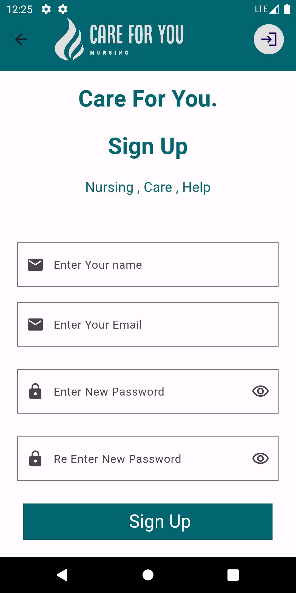  |
|------------------------------------|------------------------------------|
| 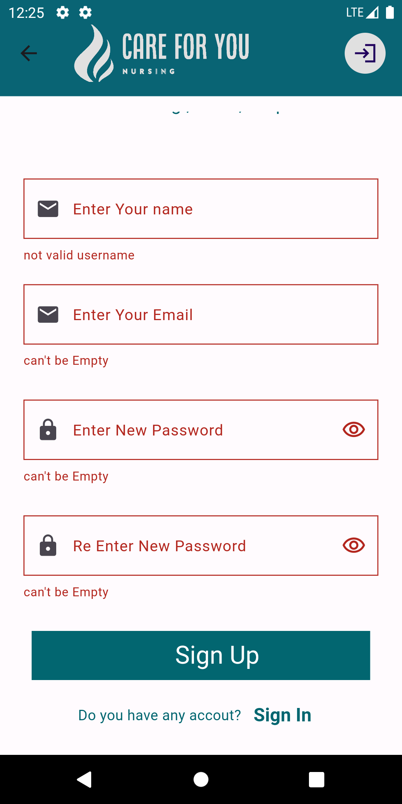  | 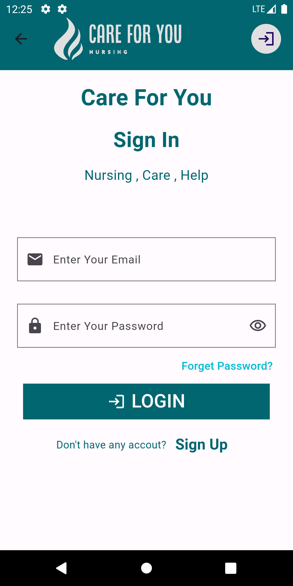  |
| 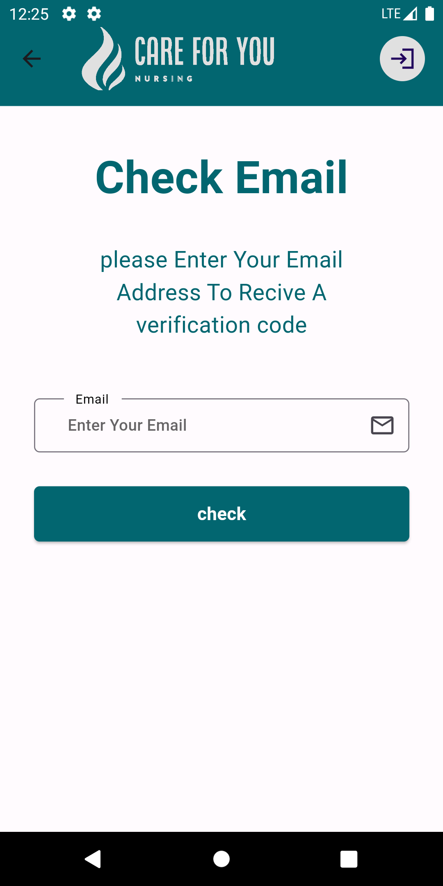  | 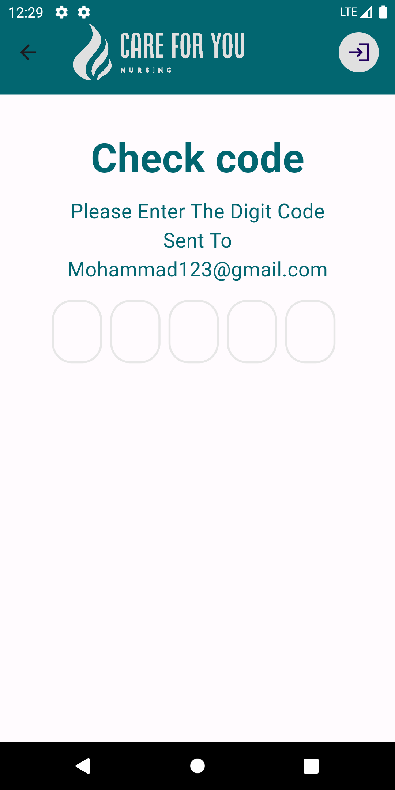  |
| 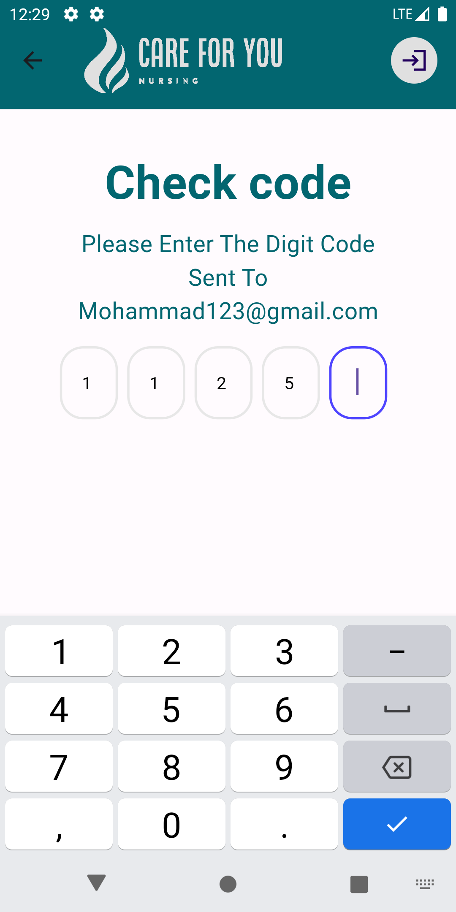  | 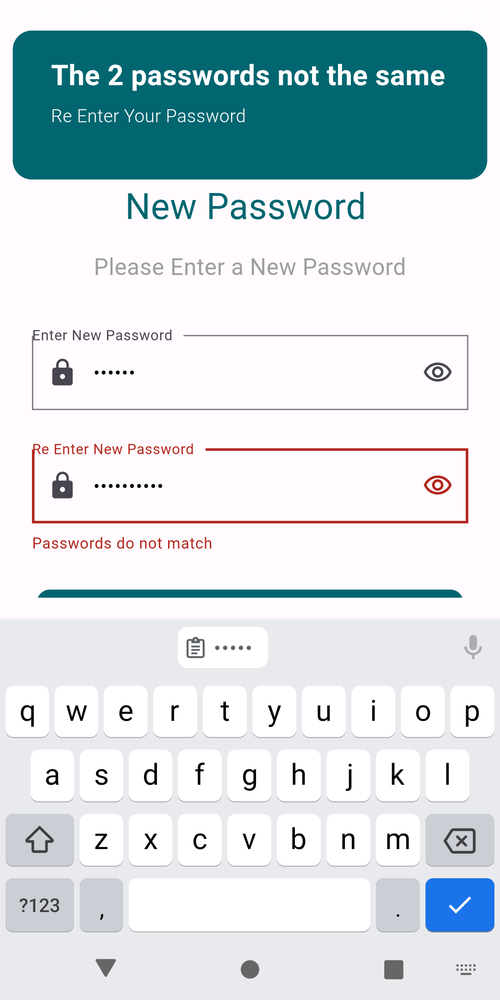  |
| 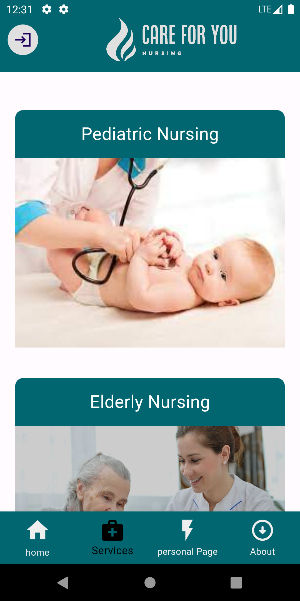  |  |
| 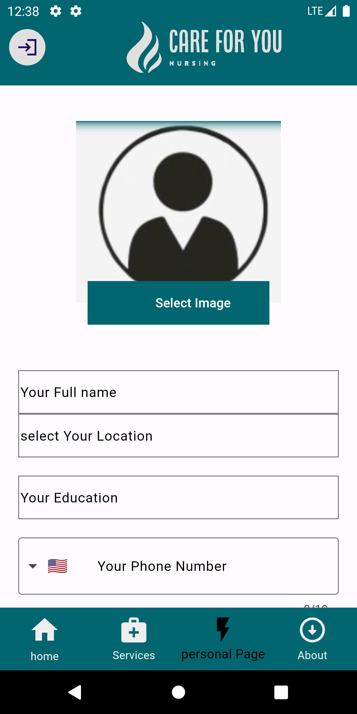 | 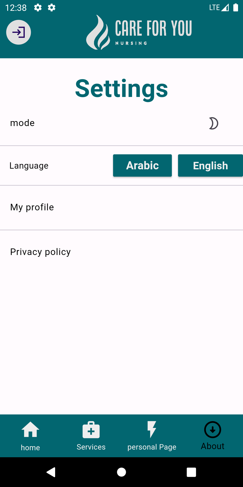 |
| 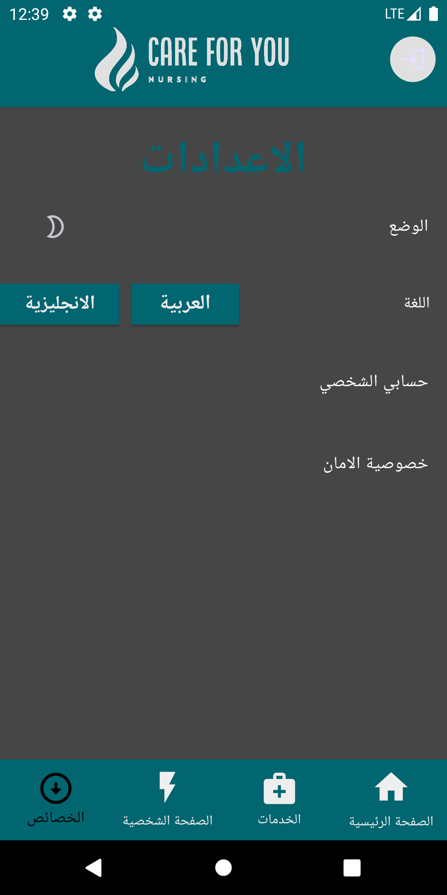 |  |

For help getting started with Flutter development, view the [online documentation](https://docs.flutter.dev/), which offers tutorials, samples, guidance on mobile development, and a full API reference.
